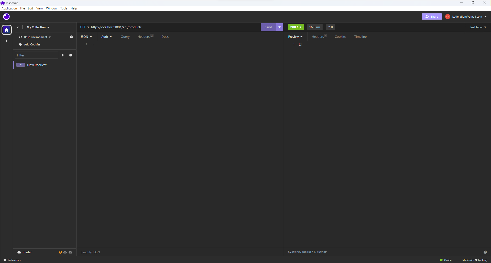

# e-commerce-back-end

## Description
This project is the built back end for an e-commerce site.

## Installation
Use npm install then npm start to run the program on your local host.

## Usage
The ideal user of this program would be the owners of the e-commerce site. 

## License

## Deployment

## Contact Information
GitHub Username: katycaroline
Email: katimation@gmail.com